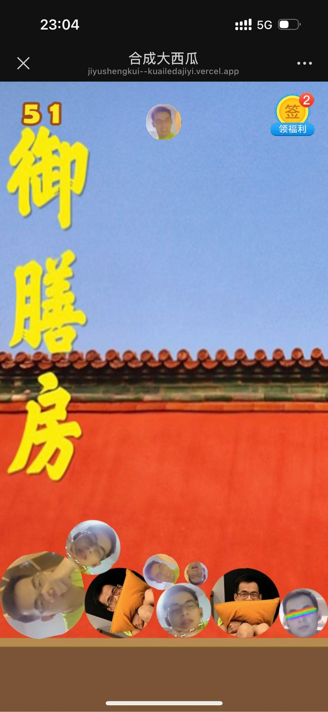
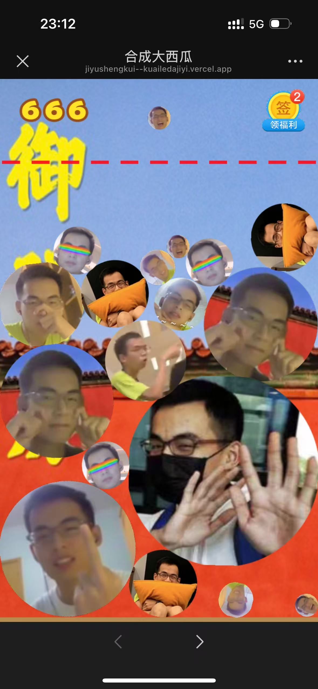

## dajiyu composition

### Overview

This is a Web App game project, and it is desigend for monbile devices with vertical screen view.\
The web service is based on Tencent cloud and you can lick [this link](https://jiyushengkui--kuailedajiyi.vercel.app/) to play the game!

You can find all source code in /src. 

Here you can have a [video demo](https://youtu.be/8J73Ipf_oyI)

Run [this link](https://jiyushengkui--kuailedajiyi.vercel.app/) to play the game.

    Use finger pull / mouse cursor to control the position to throw the ball
    Use finger release / mouse left click to throw the ball with random generated size
    Balls with same size will composite into a bigger ball
    Composite the biggest ball before filling up the interface to win the game!

  

  

